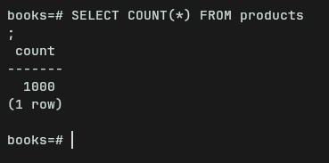

# Books Scraper (Playwright + multiprocessing)

Quack! Simple scraper for books.toscrape.com — collects product page data and stores it in PostgreSQL. Quack!

## Features

- Collects product URLs from catalog pages.
- Parses product pages (title, product_type, genre, price, stock, stars, UPC, price_excl_tax, price_incl_tax, tax, number_of_reviews, img_url, describe).
- Saves parsed data into a PostgreSQL table.
- Uses multiprocessing to distribute work between processes.
- Uses Playwright for site interaction.

## Requirements

- Python 3.8+
- PostgreSQL
- Libraries:
  - playwright
  - psycopg2-binary

## SQL DB

```sql
CREATE DATABASE books;

CREATE TABLE products (
  title TEXT,
  product_type TEXT,
  genre TEXT,
  price TEXT,
  stock TEXT,
  stars TEXT,
  upc TEXT,
  price_excl_tax TEXT,
  price_incl_tax TEXT,
  tax TEXT,
  number_of_reviews TEXT,
  img_url TEXT,
  describe TEXT
);
```

## Need create .env file
```angular2html
export db_password=<your_db_password>
export db_port=<your_db_port>
export db_host=<your_db_host>
```
## Install libraries
```
pip install -r requirements.txt
```

## In this site 50 pages, and 1000 books
- I run and get 1000 elements. It is say about he is work


